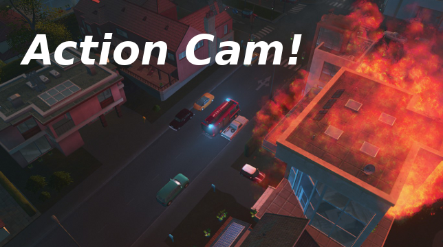

# Action Cam! A cinematic camera script for Cities: Skylines
This is a cinematic camera mod for [Cities: Skylines](https://www.paradoxplaza.com/cities-skylines/CSCS00GSK-MASTER.html). It attemps to follow the action in your city by showing you views of emergency and disaster response vehicles.

## Notes
* Cinematic camera scripts are mods, so they disable achievements.
* Vehicles and camera routines are picked at random. You may get duplicates in a row.
* Hearses are included under the health category. They are handled like any other vehicle, even if they aren't very action-packed.
* If no service vehicles are in the city at all, the camera will follow a random road in the city.

## Future
This script currently doesn't have a lot of smarts, and some camera routines might not make a lot of sense for the item being shown. I'd like to add some filters based on properties of the vehicles. For example, if a helicopter is chosen, different camera routines could be available.

If possible, I'd like to include certain buildings like buildings on fire or rubble. Currently the script only follows vehicles.

## Links
* [Camera API](https://skylines.paradoxwikis.com/Modding_API#ICamera)
* [Camera introduction developer diary](https://forum.paradoxplaza.com/forum/index.php?threads/cities-skylines-parklife-dev-diary-5-modding-and-menu-filtering.1098504/)
* [Coroutines](https://docs.unity3d.com/ScriptReference/Coroutine.html)